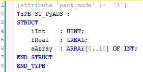

# PyADS example

An overview of PyADS features showing some basic features.

## Python 

The following is shown:
- Connecting to an existing plc
- Getting an overview of existing symbols
- Unstructured variables
    - Reading
    - Writing
- Structured variables
    - Structure definition
    - Reading
    - Writing

An `environment.yml` file is provided to help initialise the conda environment used to run the script. Create the new environment using
```
conda env create -f environment.yml
```
then activate the environment with
```
conda activate pyads-example
```

The script accepts two command line arguments `-a\--AmsNetID =default> local`, which accepts an AmsNetID. \
And `-n\--num_heartbeat =deafult> 3`, which allows you to set how many times the heartbeat variable is read and printed.

An example call is 
```
python communicate_over_ads.py -a 5.95.0.12.1.1 -n 4
```

## TwinCAT

The TwinCAT project simply holds a few variables `iHeartbeat`, which is simply a counter that indicates PLC health. and a structured data type with the following definition
<p align="center">

</p>

Make sure to add `{attribute 'pack_mode' := '1'}`, which is expected by pyads for correct byte alignment.

Just activate the test PLC on a target device and make note of the AmsNetID to use when calling the provided python script.

### Software versions used
- python = 3.9
- TwinCAT = 3.1.4024.47 

### Resources:
- PyADS: [stlehmann/pyads](https://github.com/stlehmann/pyads)
- Beckhoff ADS documentation: [Infosys](https://infosys.beckhoff.com/content/1033/tc3_ads_intro/index.html)

This code is purely for demonstrative purposes as to how to interact with the library (and the underlying system). It is *not* a programming example to implement dierectly, and *does not reflect correct coding practices.*
